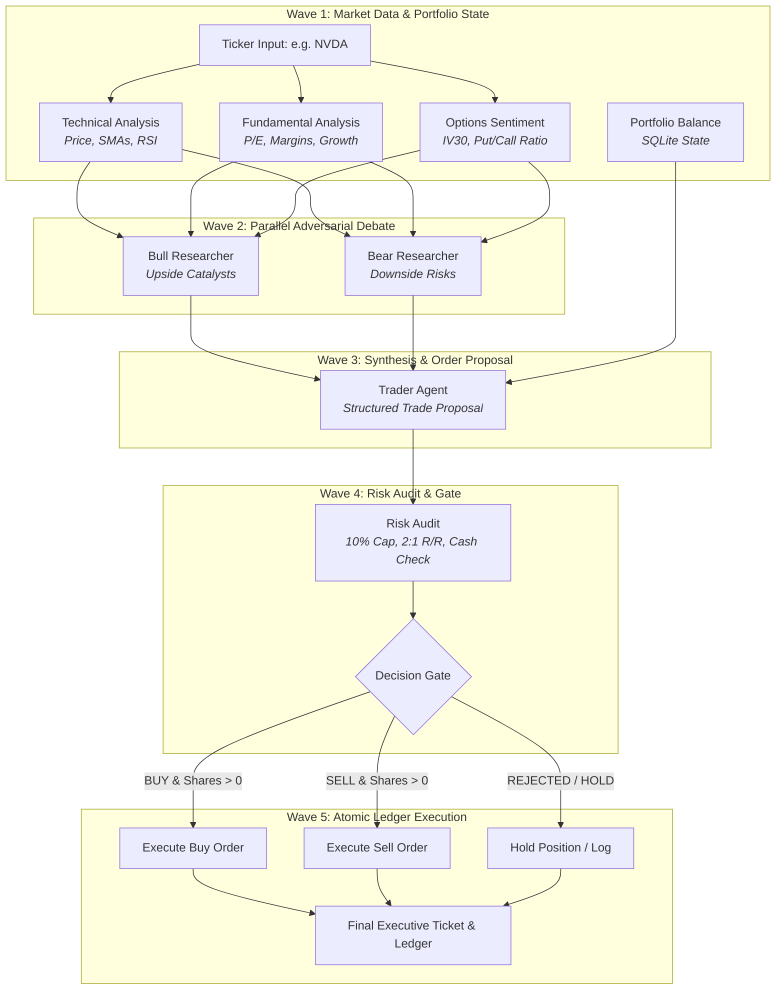

# Autonomous Institutional Trading Desk — Solace Agent Mesh (SAM)

An enterprise-grade, multi-agent financial trading desk built with declarative configurations on [Solace Agent Mesh (SAM)](https://docs.solace.com/Agent-Mesh/agent-mesh.htm).

This repository demonstrates the architectural power of **Agent Nodes vs. Tool Nodes** in AI workflow design. It provides a head-to-head comparison between an unoptimized **"All-Agent"** baseline workflow and a graph-optimized **"Hybrid Tool/Agent"** workflow that achieves an **88.5% reduction in token consumption** and **57.2% faster execution** while preserving 100% of the cognitive reasoning.

> **Disclaimer & Support Notice:** This repository is an open-source demonstration and educational reference project. It is provided **"as-is" without any official support, service level agreements (SLAs), maintenance, or warranty** from Solace. It is not an officially supported Solace product. Nothing in this repository constitutes financial, investment, trading, or tax advice.

---

## Table of Contents

- [Quickstart](#quickstart)
- [Overview & Investment Process](#overview--investment-process)
- [Workflow Architecture](#workflow-architecture)
  - [Workflow Flow Diagram](#workflow-flow-diagram)
  - [The Two Workflow Variations](#the-two-workflow-variations)
- [Benchmark Results: Head-to-Head Comparison](#benchmark-results-head-to-head-comparison)
- [Polymarket Sentiment Agent & Artifact Pattern](#polymarket-sentiment-agent--artifact-pattern)
- [Example Prompts](#example-prompts)
- [How to Run](#how-to-run)
  - [Prerequisites & Setup](#prerequisites--setup)
  - [Deploy the Configuration](#deploy-the-configuration)
  - [Executing Workflows & Agents](#executing-workflows--agents)
- [Repository Structure](#repository-structure)
- [Support & Disclaimer](#support--disclaimer)
- [License](#license)

---

## Quickstart

Get the trading desk deployed and running in under 2 minutes:

### 1. Deploy the Configuration
Ensure your environment (`.env`) and models (`models/*.yaml`) are created from the examples, then apply the manifest:

```bash
# Apply and deploy all toolsets, agents, and workflows to SAM Desktop
sam config apply -m manifests/desktop.yaml
```

*(Note: For an embedded terminal or custom URL instance, use `-m manifests/dev.yaml`).*

### 2. Run the Optimized Workflow (Recommended)
Evaluates equity tickers using zero-token tool nodes for data fetching and risk auditing, reserving LLMs strictly for adversarial debate and trade formulation:

```bash
sam task send "Evaluate NVDA for portfolio allocation" -a TradingDeskOptimized --insecure --timeout 4m
```
* **Performance:** **~2 minutes**, **~114k tokens** (88.5% token reduction, 57% faster).

### 3. Run the Unoptimized Workflow (All-Agent Baseline)
Runs the identical end-to-end investment analysis using 8 separate LLM agents across 5 waves for comparison:

```bash
sam task send "Evaluate NVDA for portfolio allocation" -a TradingDeskAllAgents --insecure --timeout 6m
```
* **Performance:** **~4.5 minutes**, **~991k tokens** (full multi-agent cognitive baseline).

---

## Overview & Investment Process

The trading desk autonomously evaluates an equity ticker (e.g. `NVDA`, `SHOP`, `AAPL`, `CLS`), formulates institutional trade proposals, and executes audited decisions through a multi-stage pipeline:

1. **Multi-Source Market Intelligence:** Ingests live technical indicators (real-time price, 20/50/200-day SMAs, 14-day RSI, MACD, support/resistance levels from Yahoo Finance), corporate fundamentals (P/E ratios, revenue growth, operating margins), and institutional options sentiment (CBOE 30-day implied volatility `IV30` and Put/Call volume/open interest ratios).
2. **Adversarial Bull vs. Bear Debate:** Dispatches specialist researchers in parallel. The **Bull Researcher** constructs the upside investment case, growth catalysts, and valuation justifications, while the **Bear Researcher** attacks valuation multiples, margin compression, and macro risks.
3. **Synthesis & Order Formulation:** The **Trader** synthesizes the adversarial debate alongside current portfolio cash holdings to draft a structured Trade Proposal (Action: `BUY`, `SELL`, or `HOLD`, suggested shares, entry limit, stop-loss, and take-profit target).
4. **Deterministic Risk Governance:** Audits the proposal against strict institutional risk rules:
   - Maximum 10% portfolio equity cap per single asset.
   - Minimum 2.0:1 reward-to-risk ratio.
   - Strict stop-loss requirement.
   - Available cash liquidity constraints (with dynamic position downsizing).
5. **Atomic Ledger Execution:** Approved and modified trades are committed to an ACID-compliant local SQLite portfolio ledger.

---

## Workflow Architecture

### Workflow Flow Diagram



### The Two Workflow Variations

| Workflow Name | File | Implementation Pattern |
|---|---|---|
| **`TradingDeskAllAgents`** | `workflows/trading-desk-all-agents.yaml` | **100% LLM Agent Nodes:** Every stage (data fetching, debate, risk check, trade execution) is dispatched as a separate LLM agent turn. |
| **`TradingDeskOptimized`** | `workflows/trading-desk-optimized.yaml` | **Hybrid Tool & Agent Nodes:** Replaces deterministic steps (market APIs, risk calculations, SQLite queries) with sub-second, zero-token `type: tool` and `type: switch` nodes. LLM cognitive reasoning is strictly reserved for the adversarial Bull/Bear debate and Trader synthesis. |

---

## Benchmark Results: Head-to-Head Comparison

Empirical performance benchmark collected on identical market conditions and ticker (`SHOP`) using `claude-sonnet-4-6`:

| Metric | All-Agent Baseline (`TradingDeskAllAgents`) | Graph-Optimized (`TradingDeskOptimized`) | Improvement |
|---|---|---|---|
| **Total Billed Tokens** | **991,542 tokens** (~1.0M) | **113,963 tokens** (~114k) | **-88.5% token reduction** |
| **Total Execution Duration** | **279.7s** (4m 40s) | **119.8s** (2m 00s) | **57.2% faster** |
| **Data Collection Tokens** | 682,051 tokens (68.8% of run) | **0 tokens** (`type: tool`) | **100% elimination** |
| **Data Collection Latency** | 67.6s | **0.35s** (Compiled Go) | **99.5% faster** |
| **Risk Audit & Execution Tokens** | 117,471 tokens | **0 tokens** (`type: tool` & `switch`) | **100% elimination** |
| **Risk Audit & Execution Latency** | 64.6s | **0.05s** (Sub-second pure Go) | **99.9% faster** |
| **Reasoning Fidelity** | Full Bull/Bear Debate + Trader | Full Bull/Bear Debate + Trader | **100% Identical** |

> **Key Takeaway:** The cheapest node in your AI workflow has no AI in it. Transitioning mechanical data lookups and deterministic calculations to tool nodes slashed nearly 900,000 tokens while maintaining institutional-grade reasoning depth.

---

## Polymarket Sentiment Agent & Artifact Pattern

This repository includes a standalone prediction market agent: **`PredictionSentimentAnalyst`** (`agents/prediction-sentiment-analyst.yaml`).

### Use Case
The agent evaluates exogenous crowd wisdom and market-implied probabilities from live [Polymarket](https://polymarket.com) contracts for macro questions, corporate events, and tech milestones.

**Example queries:**
- *"Can you check the sentiment to see who will have the best AI model at the end of the year?"*
- *"What is the prediction market probability of a 50 bps Fed rate cut next month?"*
- *"Evaluate crowd sentiment on whether Apple will release a foldable iPhone in 2026."*

### The Artifact-First Design Pattern
Directly ingesting raw API responses from prediction market APIs into an LLM's context window burns hundreds of thousands of tokens on noisy, irrelevant JSON metadata (e.g. 625k tokens on a single market query).

To solve this, `prediction_search_markets` in `finance-tools` implements the **Artifact-First Design Pattern**:
1. Fetches raw market events from Polymarket.
2. Persists the complete, uncurated raw JSON out-of-band as a SAM Data Object artifact (`polymarket_raw_search_<query>.json`).
3. Curates the top active contracts, volume, and implied probabilities into a lightweight summary returned directly to the agent.
4. If deeper inspection is needed, the agent uses targeted tools like `artifact_grep` to inspect the artifact on disk without polluting its prompt context.

**Result:** Token consumption dropped from **625,355 tokens** to **28,955 tokens** per run (**~95% token reduction**).

---

## Example Prompts

### Trading Desk Workflows
- `"Evaluate NVDA for portfolio allocation"`
- `"Use TradingDeskOptimized to evaluate SHOP — should we allocate capital today?"`
- `"Analyze CLS: assess moving averages, corporate revenue margins, and options open interest, then issue a trade recommendation"`
- `"Run an allocation review on AAPL considering current macro risks"`

### Polymarket Sentiment Agent
- `"Can you check the sentiment to see who will have the best AI model at the end of the year?"`
- `"Check Polymarket odds for who will win the US Presidential election"`
- `"Assess prediction market probabilities for whether the Federal Reserve cuts interest rates at the next FOMC meeting"`

---

## How to Run

### Prerequisites & Setup

1. **Clone the repository:**
   ```bash
   git clone https://github.com/SolaceDev/sam-finance-workflow-demo.git
   cd sam-finance-workflow-demo
   ```

2. **Configure Environment Variables:**
   Copy the example environment template:
   ```bash
   cp .env.example .env
   ```
   Edit `.env` to set your LLM API key:
   ```bash
   OPENROUTER_API_KEY=your-api-key-here
   # Or configure LLM_SERVICE_API_KEY if using an internal LiteLLM / proxy gateway
   ```

3. **Configure Model Providers:**
   Create active model configurations from the provided examples:
   ```bash
   cp models/general.yaml.example models/general.yaml
   cp models/planning.yaml.example models/planning.yaml
   ```

### Deploy the Configuration

Plan and apply the declarative configuration against your running SAM instance.

#### For SAM Desktop Users (Recommended):
Use `manifests/desktop.yaml` which automatically discovers and connects to the running SAM Desktop app (`target.name: desktop` with no login required):

```bash
# Preview proposed changes
sam config plan -m manifests/desktop.yaml

# Apply and deploy toolsets, agents, and workflows
sam config apply -m manifests/desktop.yaml
```

*(If you are running an embedded terminal or remote instance instead of Desktop, use `-m manifests/dev.yaml` to target `http://127.0.0.1:8800` directly).*

### Executing Workflows & Agents

You can invoke the workflows and agents either via the **SAM CLI** or through the **SAM Web UI**.

#### Understanding the Workflow Choices

| Workflow / Agent | Target Name (`-a`) | Best Used For | Execution Profile |
|---|---|---|---|
| **Graph-Optimized Workflow** | `TradingDeskOptimized` | Daily portfolio analysis, production trading decisions, fast evaluations. | **~2 minutes**, **~114k tokens** (88.5% cheaper, 57% faster) |
| **All-Agent Baseline Workflow** | `TradingDeskAllAgents` | Demonstrating pure multi-agent mesh orchestration, research baselines, and benchmarking. | **~4.5 minutes**, **~991k tokens** (10 full LLM agent turns) |
| **Polymarket Sentiment Agent** | `PredictionSentimentAnalyst` | Standalone crowd-probability queries on macro events, tech milestones, and earnings odds. | **~30-60 seconds**, **~28k tokens** (artifact-backed) |

---

#### Method 1: Running via SAM CLI (`sam task send`)

`sam task send` sends a task prompt directly to the workflow entrypoint and streams back real-time progress and output:

##### Key CLI Flags:
- `-a, --agent <name>`: Names the target workflow (`TradingDeskOptimized` or `TradingDeskAllAgents`) or agent (`PredictionSentimentAnalyst`).
- `--timeout <duration>`: Multi-agent workflows execute parallel LLM reasoning waves. Use `--timeout 4m` for the optimized workflow and `--timeout 6m` for the unoptimized baseline.
- `--insecure`: Required when connecting to local or internal HTTP endpoints (e.g. `http://127.0.0.1:8800`) without TLS.
- `-d, --data '<json>'`: (Optional) Explicitly inject typed inputs matching the workflow schema (e.g. `{"ticker": "SHOP"}`).

##### 1. Execute the Graph-Optimized Workflow (Recommended)
Evaluates any equity ticker using sub-second tool nodes for data/risk and LLMs for the Bull/Bear debate:

```bash
# Natural language invocation (evaluates NVDA)
sam task send "Evaluate NVDA for portfolio allocation" -a TradingDeskOptimized --insecure --timeout 4m

# Explicit structured ticker input (evaluates SHOP)
sam task send "Evaluate SHOP for portfolio allocation" -a TradingDeskOptimized -d '{"ticker": "SHOP"}' --insecure --timeout 4m

# Evaluating other tickers (e.g. CLS, AAPL, AMZN)
sam task send "Evaluate CLS: analyze momentum, fundamentals, and options sentiment to recommend a position" -a TradingDeskOptimized -d '{"ticker": "CLS"}' --insecure --timeout 4m
```

##### 2. Execute the All-Agent Baseline Workflow
Dispatches 8 specialized LLM agents across 5 waves for comparison:

```bash
# Natural language invocation
sam task send "Evaluate NVDA for portfolio allocation" -a TradingDeskAllAgents --insecure --timeout 6m

# Explicit structured ticker input
sam task send "Evaluate SHOP for portfolio allocation" -a TradingDeskAllAgents -d '{"ticker": "SHOP"}' --insecure --timeout 6m
```

##### 3. Query the Standalone Polymarket Sentiment Agent
Query live crowd-implied probabilities for any real-world event:

```bash
# Tech / AI sentiment query
sam task send "Can you check the sentiment to see who will have the best AI model at the end of the year?" -a PredictionSentimentAnalyst --insecure --timeout 2m

# Macro / Interest rate query
sam task send "Check Polymarket odds for whether the Fed will cut interest rates at the next FOMC meeting." -a PredictionSentimentAnalyst --insecure --timeout 2m
```

---

#### Method 2: Running via SAM Web UI

1. Open your browser to the SAM Web Console (default: `http://localhost:8800`).
2. In the chat interface, click the agent/workflow dropdown picker.
3. Select **`TradingDeskOptimized`** (or **`TradingDeskAllAgents`**).
4. Enter your prompt (e.g., `"Evaluate NVDA for portfolio allocation"` or `"Analyze SHOP"`).
5. Watch the execution canvas illuminate in real time as Wave 1 (Data Fetching), Wave 2 (Bull vs. Bear Debate), Wave 3 (Trade Formulation), Wave 4 (Risk Audit), and Wave 5 (Ledger Commit) execute sequentially and concurrently.

---

#### What to Expect in the Final Output

Both workflows emit a comprehensive **Executive Trade Ticket** containing:
1. **Quantitative Technicals:** Real-time price, 20/50/200-day SMAs, 14-day RSI, MACD signal, and key support/resistance levels.
2. **Fundamental Analysis:** P/E multiples, YoY quarterly revenue growth, operating margins, and balance sheet assessment.
3. **Institutional Options Flow:** 30-day implied volatility (`IV30`), Put/Call volume and open interest ratios, and market regime.
4. **Bull vs. Bear Research Summary:** Core growth catalysts weighed directly against multiple compression and macro headwinds.
5. **Trade Proposal & Risk Verdict:** Proposed action (`BUY`, `SELL`, or `HOLD`), suggested shares, limit price, stop-loss, profit target, and risk officer audit findings (10% single-asset cap, 2:1 R/R, and cash liquidity check).
6. **SQLite Ledger Transaction:** Atomic trade execution record and updated portfolio cash/position balances.

---

## Repository Structure

```text
├── manifests/
│   ├── desktop.yaml                  # Primary deployment manifest targeting SAM Desktop (target.name: desktop)
│   └── dev.yaml                      # Alternative manifest targeting local/embedded URL (http://127.0.0.1:8800)
├── workflows/
│   ├── trading-desk-optimized.yaml   # Hybrid workflow (tool nodes + switch gates + debate agents)
│   └── trading-desk-all-agents.yaml  # Baseline 100% agent workflow (5 waves, 8 agents)
├── agents/
│   ├── market-analyst.yaml           # Technical analysis specialist
│   ├── fundamentals-analyst.yaml     # Fundamental balance sheet & valuation specialist
│   ├── options-analyst.yaml          # CBOE options flow & IV30 specialist
│   ├── prediction-sentiment-analyst.yaml # Polymarket crowd probability specialist
│   ├── bull-researcher.yaml          # Adversarial upside researcher
│   ├── bear-researcher.yaml          # Adversarial downside risk researcher
│   ├── trader.yaml                   # Order proposal synthesizer
│   ├── risk-officer.yaml             # Risk audit specialist (baseline)
│   └── portfolio-manager.yaml        # CIO trade executor (baseline)
├── toolsets/
│   └── finance-tools/                # Pure Go toolset (samtoolsdk)
│       └── src/
│           ├── technicals.go         # Live Yahoo Finance price, SMAs & RSI engine
│           ├── fundamentals.go       # Financial metrics lookup
│           ├── options.go            # CBOE delayed options chain parser
│           ├── portfolio.go          # SQLite ledger & deterministic risk audit engine
│           └── prediction.go         # Polymarket search & artifact-offload engine
├── models/
│   ├── general.yaml.example          # Sanitized model config template
│   └── planning.yaml.example         # Sanitized planning model config template
├── BENCHMARKS.md                     # Detailed token and latency benchmark measurements
├── .env.example                      # Environment variables template
└── .gitignore                        # Git exclusion rules (protects credentials & stim traces)
```

---

## Support & Disclaimer

### No Official Support
This project is an open-source demonstration and community example developed to illustrate workflow optimization patterns on Solace Agent Mesh. **It is provided strictly on an "AS-IS" basis without official commercial support, warranty, or commitment to future updates from Solace.** 

- Do not contact Solace Customer Support regarding issues or questions related to this demo.
- For community discussion, feedback, or sharing ideas, visit the [Solace Community Forum](https://solace.community/) or open an issue/discussion in this repository.

### Financial Advice Disclaimer
The code, market analysis tools, and workflows contained in this repository are for educational, prototyping, and demonstration purposes only. They simulate institutional trading desk workflows using publicly available delayed quotes and paper portfolio tracking. **Nothing in this repository constitutes financial, investment, legal, or trading advice.**

---

## License

This project is licensed under the Apache License 2.0.
